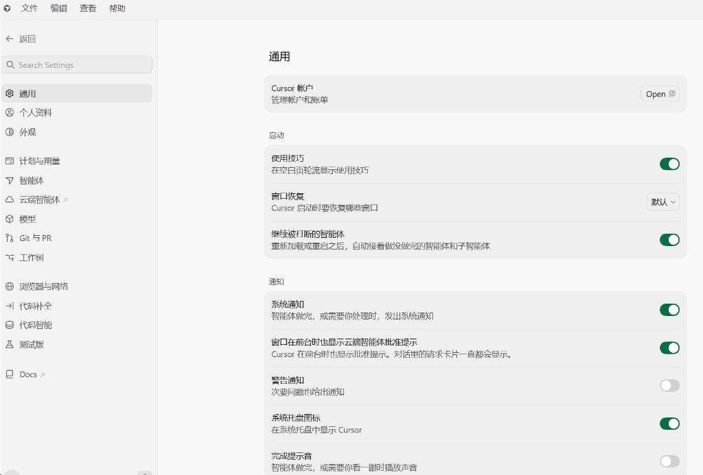
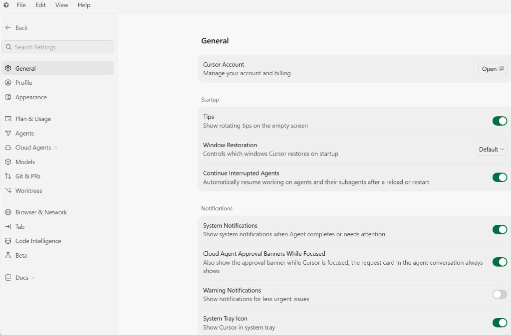

# Cursor Language Pack

Cursor 的多语言工具包，目前支持简体中文和繁体中文。

[English](README.md) · **简体中文**


[](https://open-vsx.org/extension/polang233/cursor-language-pack)
[](https://open-vsx.org/extension/polang233/cursor-language-pack)





有两种安装方式。只安装插件，只能翻译一部分界面。下载项目后运行命令，可以翻译绝大部分界面。

## 只汉化 VS Code 部分

装一个扩展即可。改动只在插件里，菜单、文件、编辑器、终端会变成中文。设置页、智能体窗口、账号页里写死的英文不会变。

1. 卸载其他语言包。本扩展替代 VS Code 官方中文语言包，两个同时装，重启后翻译会乱。
2. 扩展里搜索 **汉化** 或 **中文语言包**，安装。也可以从 [GitHub Release](https://github.com/polang233/cursor-language-pack/releases) 下 `.vsix`，命令面板执行 **Extensions: Install from VSIX…**。Windows 不要双击 `.vsix`。
3. 命令面板 → **Language Pack: Select Display Language** → 选 **中文（简体）** 或 **中文（繁體）** → **完全退出 Cursor 再打开**。重载窗口无效。

之后换语言不用重装，仍然要重启：

- 命令面板 → **Language Pack: Select Display Language**
- 设置 `cursorLanguagePack.language`：`auto`、`zh-cn`、`zh-tw`、`en`

选 `en` 回到英文，扩展还在。

## 全局翻译

设置页、智能体窗口、账号页的英文写在程序文件里，扩展改不到。要改安装目录，然后重启。

先完全退出 Cursor。安装 Node.js 18，下载本仓库后执行：

```bash
npm install
npm run translate
```

脚本会备份并改写那些英文，更新安装校验，装上语言包，并把显示语言设为简体中文。再打开 Cursor。

繁体把最后一行换成 `npm run translate -- --locale=zh-tw`。找不到安装目录时加上 `--dir="安装目录"`，这一层要能看到 `resources/app`。macOS 填 `Cursor.app/Contents`。

Cursor 更新后这些改动会消失，再执行一次。只还原程序文件：`npm run translate -- --undo`。语言包和显示语言不动。

Cursor 这个产品名和 MCP 仍是英文。

## 语言

| 语言 | 状态 |
| --- | --- |
| `zh-cn` 简体中文 | 已发布。工作台 12725/12747（99.8%），自有界面 1741 键（100%），另有 578 条写死文案 |
| `zh-tw` 繁體中文 | 已发布。数字与简体相同 |
| `ja` `ko` `fr` `de` `es` `it` `ru` `pt-br` `tr` `pl` `cs` | 已预留，尚无译文 |

一个扩展包含已启用的语言。写死文案要运行上面的命令才会改掉；没翻的句子显示英文。

当前翻译对应 Cursor **3.21.13**。低于这个版本一般能用。高于这个版本时，新增的界面会先显示英文，等我们补上译文。

### 添加语言

1. 在 `config.json` 把该语言的 `enabled` 设为 `true`。
2. 添加 `src/i18n/<locale>/`，先写术语表，再写 `cursor/` 下的译文。
3. 全局翻译另写 `hardcoded.json`。可从 `src/i18n/zh-cn/hardcoded.json` 复制，只改右边。`npm run translate -- --locale=<locale>` 读的就是这份文件。
4. `npm run build && npm run validate && npm run coverage`。

细节：[CONTRIBUTING.md](CONTRIBUTING.md#adding-a-language)。

## 开发

Node.js 18.17+。

```bash
npm install
npm run detect
npm run extract
npm run sync
npm run verify
npm run package
npm run translate -- --preview
npm run check-upgrade
```

文档：[架构](docs/architecture.zh-CN.md) · [贡献](CONTRIBUTING.md) · [发布](docs/publishing.zh-CN.md)

## 许可

MIT。工作台译文来自 [microsoft/vscode-loc](https://github.com/microsoft/vscode-loc)；见 [NOTICE](NOTICE)。

社区项目，与 Anysphere、Microsoft 无隶属关系。
