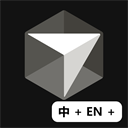

# Cursor Language Pack

[Cursor](https://cursor.com/) 的社区语言包：翻译编辑器主体，**以及** Cursor 写进 Code OSS NLS
文件里的文案（composer、agents、aiSettings 等模块）。

[English](README.md) · **简体中文**

> 安装前请先卸载其他语言包，装完选显示语言后**重启** Cursor。



本项目按多语言设计。**当前发布简体中文和繁体中文。** 另外 11 种语言已在 `config.json` 里声明，
等译者填译文；见 [添加语言](#添加语言)。

## 安装

1. **先卸载其他语言包。** 本扩展替代 VS Code 官方语言包 —
   [原因](docs/architecture.zh-CN.md#单个自包含扩展)。两个包并存时，每次重启翻译结果都不一样。
2. 安装：
   - [VS Marketplace](https://marketplace.visualstudio.com/items?itemName=polang233.cursor-language-pack)（Cursor 扩展搜索走的就是这家商店）
   - 或 GitHub Release 的 `.vsix` — 命令面板 → **Extensions: Install from VSIX…**
3. 命令面板 → **Language Pack: Select Display Language** → 选语言 → 重启。

Windows 上不要双击 `.vsix`，文件类型可能被 Visual Studio 抢走。请用命令面板安装。

### 之后切换语言

三种方式等价，都不用重装 —— 打包进去的语言已经在本地：

- 命令面板 → **Language Pack: Select Display Language**
- 设置 → `cursorLanguagePack.language`（`auto`、`zh-cn`、`zh-tw`、`en`）
- 自带的 **Configure Display Language**

选 `en` 就是整个界面回到英文，扩展留着。三者都只写 `argv.json` 的 `locale` 字段。显示语言是启动参数，必须重启 Cursor，重载窗口无效。

## 语言支持

| 语言 | 状态 |
| --- | --- |
| `zh-cn` 简体中文 | 已发布 — 工作台 99.8% + Cursor 自有 NLS 1621 键（100%） |
| `zh-tw` 繁體中文 | 已发布 — 同一覆盖面，台湾用词 |
| `ja` `ko` `fr` `de` `es` `it` `ru` `pt-br` `tr` `pl` `cs` | 已在 `config.json` 声明，`enabled: false`，尚无译文 |

一个扩展声明所有已启用语言；Cursor 按 `argv.json` 的 `locale` 加载，缺译文的键回落英文。

### 添加语言

1. 在 `config.json` 把对应 locale 的 `enabled` 设为 `true`。若
   [microsoft/vscode-loc](https://github.com/microsoft/vscode-loc) 没有这种语言，把
   `upstreamPackDir` 设为 `null`：工作台保持英文，只翻译 Cursor 自己的字符串。
2. 添加 `src/i18n/<locale>/` — 先写术语表，再写译文。
3. `npm run build && npm run validate && npm run coverage`。

逐步说明：[CONTRIBUTING.md](CONTRIBUTING.md#adding-a-language)。

## 已知限制

下面这些 Cursor 没有外置，语言包碰不到，请不要在这里提翻译问题：

- Cursor Settings
- Agent / Chat 浮层（对话周围的 React 界面）
- 账号 / 商店浮层

界面语言不会改变 AI 回复用的语言。

已对齐 Cursor **3.16.17**（Code OSS 1.128.0），见 `config.json` 的
`target.verifiedCursorVersions`。其他版本一般能用；之后新增的字符串会先回落英文，直到有人跑
`npm run check-upgrade` 并补译文。

## 开发

Node.js 18.17 或更新。没有编译步骤。

```bash
npm install
npm run detect
npm run extract
npm run sync
npm run verify
npm run package
npm run check-upgrade
```

流水线和目录布局搬自
[kiro-language-pack](https://github.com/polang233/kiro-language-pack)，换成 Cursor 的路径，并且优先发 VS Marketplace（Cursor 的商店是 `marketplace.cursorapi.com`，不是 Open VSX）。

文档：[架构](docs/architecture.zh-CN.md) · [贡献](CONTRIBUTING.md) ·
[发布](docs/publishing.zh-CN.md) · [全部文档](docs/README.zh-CN.md)

## 许可

MIT。工作台译文来自 MIT 许可的 [microsoft/vscode-loc](https://github.com/microsoft/vscode-loc)；见 [NOTICE](NOTICE)。

社区项目。与 Anysphere、Microsoft 无隶属、无背书、无支持关系。
